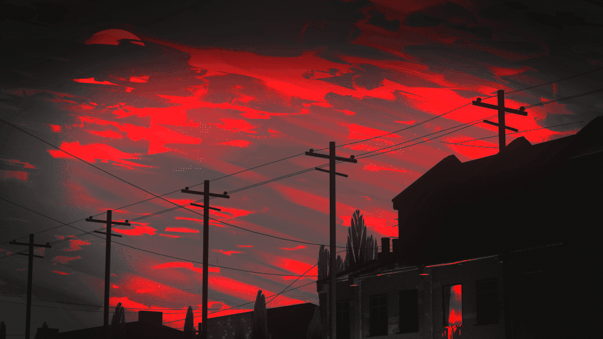

<!-- ────────────────────────────────────────────────────────────────────────────── -->
<!--  Personal Banner → swap for a custom GIF/JPG (600 × 120 works nicely)        -->
<!-- ────────────────────────────────────────────────────────────────────────────── -->

  

<h1 align="center">
  Yo! I’m Kartik Manchanda&nbsp;
</h1>

<h3 align="center">
  🛠️ Builder at heart &nbsp;|&nbsp; 📚 Learner for life  
   Because great software isn’t built by accident
</h3>

  
  
  

---

### 🧑‍💻 About&nbsp;Me
- 💬 Ask me about Node, TypeScript, Docker, Prisma, MongoDB & PostgreSQL  
- ⚡ **Fun fact: Sometimes I stare at my deployed app like it’s a sunset I built myself.**  
- 🕹 AOT devotee — *“The only thing we’re allowed to do is to believe that we won’t regret the choice we made.”* — **Levi Ackermann**

---

### ⚒️ Tech Stack

  

---

### 📈 GitHub Analytics

  
  

  

---

### 🏆 Trophies

  

---

### 🤝 Connect With Me

  
  
  

---

  
   
  <em>“Dedicate your hearts!” — Erwin Smith</em>

